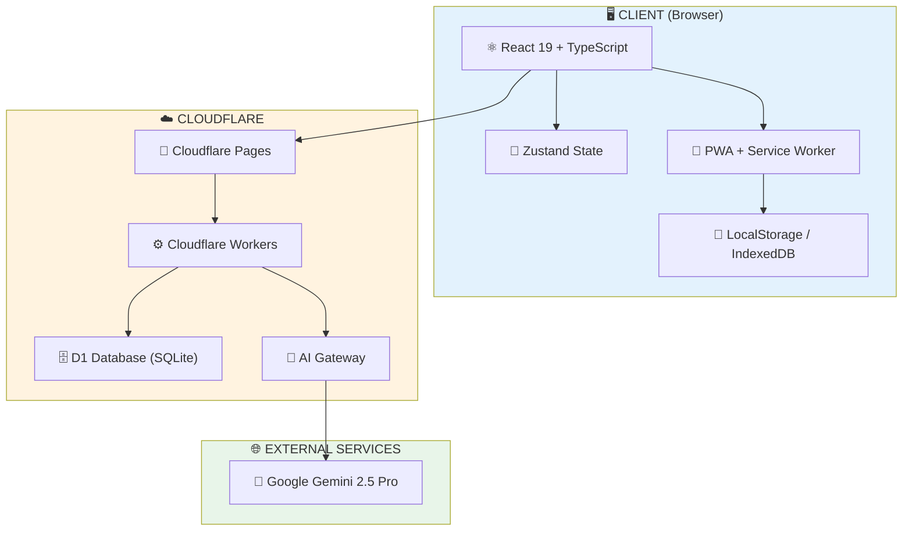
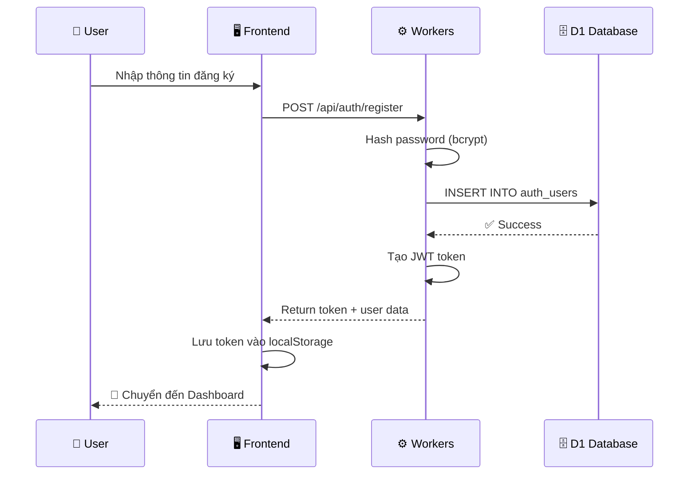
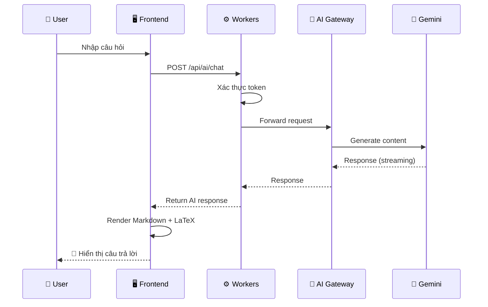
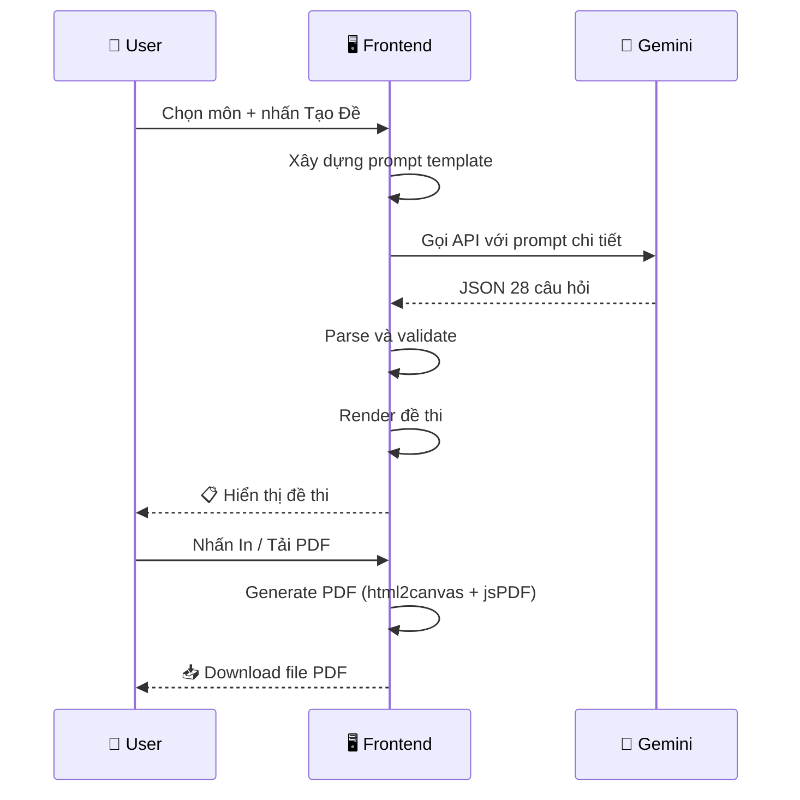
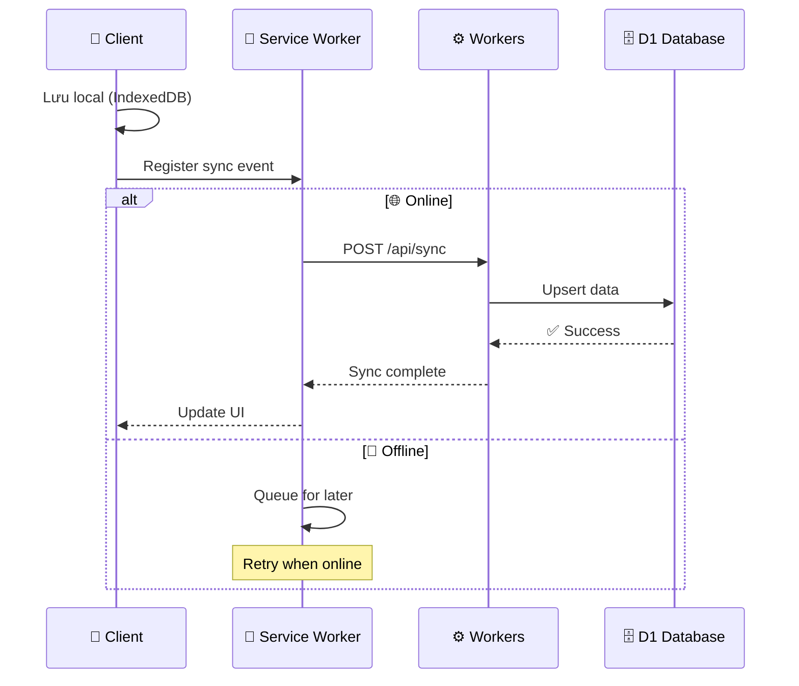
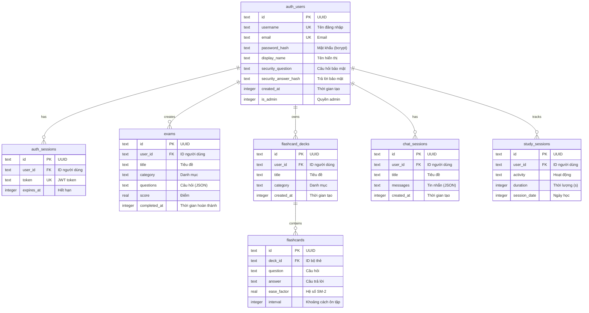

<p align="center">
  
  
  
  
  
</p>

# 🎓 STEM Vietnam - Nền Tảng Học Tập Thông Minh Với AI

> **Đồ án tốt nghiệp** - Trường Đại học Sư phạm Hà Nội  
> Nền tảng hỗ trợ học sinh THPT ôn thi môn **Công nghệ** với AI, dựa trên chương trình SGK **Kết nối tri thức** và **Cánh Diều**.

---

## 📋 Mục Lục

1. [Giới thiệu](#-giới-thiệu)
2. [Tính năng](#-tính-năng)
3. [Kiến trúc hệ thống](#-kiến-trúc-hệ-thống)
4. [Luồng hoạt động](#-luồng-hoạt-động)
5. [Công nghệ sử dụng](#-công-nghệ-sử-dụng)
6. [Cấu trúc thư mục](#-cấu-trúc-thư-mục)
7. [Database Schema](#-database-schema)
8. [API Endpoints](#-api-endpoints)
9. [Hướng dẫn cài đặt](#-hướng-dẫn-cài-đặt)
10. [Triển khai](#-triển-khai)
11. [Liên hệ](#-liên-hệ)

---

## 🎯 Giới Thiệu

**STEM Vietnam** là ứng dụng web hỗ trợ học tập thông minh, tích hợp AI (**Google Gemini 2.5 Pro**) để:

- 🤖 Chat hỏi đáp kiến thức môn Công nghệ
- 📝 Tạo đề thi THPT Quốc Gia tự động (28 câu chuẩn format)
- 🃏 Flashcards học từ vựng thông minh với Spaced Repetition
- 💻 Coding Lab học lập trình cơ bản

### Điểm nổi bật

| Tính năng | Mô tả |
|-----------|-------|
| 🌐 **PWA** | Hoạt động offline, cài đặt như ứng dụng native |
| ⚡ **Edge Computing** | API serverless trên Cloudflare Workers |
| 🔒 **Bảo mật** | JWT authentication, bcrypt hashing |
| 📊 **Đồng bộ** | Sync dữ liệu đa thiết bị qua cloud |

---

## ✨ Tính Năng

### 1. 🤖 Chat AI Thông Minh (Product 1)

```
┌─────────────────────────────────────────────────────────┐
│  💬 Chat AI - Hỏi Đáp Kiến Thức                         │
├─────────────────────────────────────────────────────────┤
│  ✅ Hỏi đáp với Gemini 2.5 Pro                          │
│  ✅ Upload file PDF, DOCX, hình ảnh để AI phân tích     │
│  ✅ Trả lời có công thức LaTeX, sơ đồ Mermaid           │
│  ✅ Lưu lịch sử chat, export ra file                    │
│  ✅ Context Wizard - Gợi ý prompt thông minh            │
└─────────────────────────────────────────────────────────┘
```

### 2. 📝 Tạo Câu Hỏi (Product 2)

- Tạo câu hỏi trắc nghiệm theo chủ đề
- Phân loại theo mức độ nhận thức: **Nhớ**, **Hiểu**, **Vận dụng**, **Vận dụng cao**
- Hỗ trợ bài giảng Công nghiệp và Nông nghiệp

### 3. 📋 Tạo Đề Thi THPT (Product 3-4)

```
┌──────────────────────────────────────┐
│   ĐỀ THI THPT QUỐC GIA (28 câu)      │
├──────────────────────────────────────┤
│  📌 24 câu trắc nghiệm 4 lựa chọn    │
│  📌 4 câu Đúng/Sai (mỗi câu 4 ý a-d) │
│  📌 Phân bố mức độ chuẩn Bộ GD&ĐT    │
│  📌 Xuất PDF / In trực tiếp          │
└──────────────────────────────────────┘
```

### 4. 🃏 Flashcards (Product 5)

- Tạo flashcard từ nội dung tùy ý
- Thuật toán **Spaced Repetition SM-2**
- Đồng bộ đa thiết bị qua cloud
- Thống kê tiến độ học tập

### 5. 📚 Bộ Đề Luyện Tập (Product 6)

- Bộ đề có sẵn để luyện tập
- Chấm điểm tự động
- Lưu lịch sử làm bài

### 6. 📖 Tổng Hợp Bài Giảng (Product 7)

- Tài liệu học tập theo chương trình SGK
- Phân loại theo lớp và môn học

### 7. 💻 Coding Lab (Product 8)

- Học lập trình tương tác
- Bài tập từ cơ bản đến nâng cao
- Code editor trực tiếp trong trình duyệt
- Mô phỏng Arduino

---

## 🏗 Kiến Trúc Hệ Thống



### Mô tả các thành phần

| Thành phần | Vai trò |
|------------|---------|
| **React + TypeScript** | Frontend SPA, render UI |
| **Zustand** | State management nhẹ |
| **PWA + Service Worker** | Offline-first, caching |
| **Cloudflare Pages** | Hosting static files |
| **Cloudflare Workers** | Serverless API backend |
| **D1 Database** | SQLite database trên edge |
| **AI Gateway** | Proxy và cache API calls tới Gemini |
| **Gemini 2.5 Pro** | LLM xử lý ngôn ngữ tự nhiên |

---

## 🔄 Luồng Hoạt Động

### Luồng Đăng Ký / Đăng Nhập



### Luồng Chat AI



### Luồng Tạo Đề Thi



### Luồng Sync Dữ Liệu



---

## 🛠 Công Nghệ Sử Dụng

### Frontend

| Công nghệ | Phiên bản | Logo | Mục đích |
|-----------|-----------|------|----------|
| React | 19.2 | ⚛️ | UI library |
| TypeScript | 5.8 | 📘 | Static typing |
| Vite | 6.4 | ⚡ | Build tool |
| Tailwind CSS | 3.4 | 🎨 | Styling |
| Zustand | 5.0 | 🐻 | State management |
| React Router | 7.1 | 🧭 | Routing |
| Zod | 3.24 | ✅ | Schema validation |

### Backend

| Công nghệ | Logo | Mục đích |
|-----------|------|----------|
| Cloudflare Workers | ☁️ | Serverless runtime |
| D1 Database | 🗄️ | SQLite on edge |
| itty-router | 🛣️ | Lightweight router |
| bcryptjs | 🔒 | Password hashing |

### AI/LLM

| Công nghệ | Logo | Mục đích |
|-----------|------|----------|
| Google Gemini 2.5 Pro | 🤖 | LLM chính |
| Cloudflare AI Gateway | 🚀 | Proxy + caching |

### Tooling & Testing

| Công nghệ | Logo | Mục đích |
|-----------|------|----------|
| Vitest | 🧪 | Unit testing |
| Playwright | 🎭 | E2E testing |
| ESLint | 📝 | Linting |
| Wrangler | 🔧 | Cloudflare CLI |

---

## 📁 Cấu Trúc Thư Mục

```
totnghiepcongnghecungai1/
│
├── 📄 App.tsx                    # Root component với routing
├── 📄 index.tsx                  # Entry point
├── 📄 index.html                 # HTML template
├── 📄 index.css                  # Global styles
├── 📄 types.ts                   # TypeScript type definitions
│
├── 📁 components/                # React components (64 files)
│   ├── 🏠 Home.tsx               # Landing page
│   ├── 📊 Dashboard.tsx          # User dashboard
│   ├── 🔐 LoginModal.tsx         # Modal đăng nhập/đăng ký
│   ├── 👤 Profile.tsx            # Trang cá nhân
│   │
│   ├── 🤖 Product1.tsx           # Chat AI
│   ├── 📝 Product2.tsx           # Tạo câu hỏi
│   ├── 📋 Product3.tsx           # Đề thi Công nghiệp
│   ├── 📋 Product4.tsx           # Đề thi Nông nghiệp
│   ├── 🃏 Product5.tsx           # Flashcards
│   ├── 📚 Product6.tsx           # Bộ đề luyện tập
│   ├── 📖 Product7.tsx           # Bài giảng
│   ├── 💻 Product8.tsx           # Coding Lab
│   │
│   ├── 💬 ChatInterface.tsx      # Chat UI component
│   ├── 💬 ChatSidebar.tsx        # Chat history sidebar
│   ├── 💬 MessageList.tsx        # Message display
│   ├── 🎯 QuestionCard.tsx       # Question display
│   ├── 🃏 Flashcards.tsx         # Flashcard component
│   ├── 💻 CodingLab.tsx          # Code editor
│   ├── 🔌 ArduinoSimulator.tsx   # Arduino simulation
│   │
│   ├── 📁 auth/                  # Auth components
│   ├── 📁 layout/                # Layout components
│   └── 📁 __tests__/             # Component tests (8 files)
│
├── 📁 contexts/                  # React contexts
│   ├── 🔐 AuthContext.tsx        # Authentication state
│   └── 🎨 ThemeContext.tsx       # Theme state
│
├── 📁 store/                     # Zustand stores
│   ├── 🌐 appStore.ts            # App-wide state
│   ├── 🔐 authStore.ts           # Auth state
│   ├── 💬 chatStore.ts           # Chat state
│   ├── 📋 examStore.ts           # Exam state
│   └── 🃏 flashcardStore.ts      # Flashcard state
│
├── 📁 utils/                     # Utilities (24 files)
│   ├── 🤖 geminiAPI.ts           # Gemini API client
│   ├── 💬 chatStorage.ts         # Chat persistence
│   ├── 🔑 tokenManager.ts        # JWT management
│   ├── 🔄 syncManager.ts         # Data synchronization
│   ├── 📱 pwaUtils.ts            # PWA helpers
│   ├── 📄 exportPDF.ts           # PDF generation
│   ├── 🃏 flashcardStorage.ts    # Flashcard persistence
│   ├── ⚠️ errorHandler.ts        # Error handling
│   ├── 🔄 retry.ts               # Retry logic
│   ├── 💾 cacheManager.ts        # Cache management
│   └── 📁 __tests__/             # Utility tests (4 files)
│
├── 📁 schemas/                   # Zod validation schemas
│   ├── 🤖 ai.schema.ts           # AI response schemas
│   ├── 🔐 auth.schema.ts         # Auth schemas
│   ├── 💬 chat.schema.ts         # Chat schemas
│   ├── 📋 exam.schema.ts         # Exam schemas
│   └── 🃏 flashcard.schema.ts    # Flashcard schemas
│
├── 📁 hooks/                     # Custom React hooks
│   └── 🎯 useTourGuide.ts        # Tour guide hook
│
├── 📁 data/                      # Static data
│   ├── 📚 codingLessons.ts       # Coding lessons content
│   ├── 📝 codingQuizzes.ts       # Quiz data
│   └── 🎯 tourSteps.ts           # Tour guide steps
│
├── 📁 public/                    # Static assets
│   ├── 📱 manifest.json          # PWA manifest
│   ├── 🔧 service-worker.js      # Service worker
│   ├── 📁 icons/                 # App icons
│   ├── 📁 images/                # Images
│   └── 📁 assets/                # Other assets
│
├── 📁 workers/                   # Cloudflare Workers backend
│   ├── 📁 src/                   # Source code
│   │   ├── 🛣️ index.ts           # API routes
│   │   ├── 🔐 auth-service.ts    # Authentication logic
│   │   └── 🔧 utils.ts           # Helpers
│   ├── 🗄️ full_schema.sql        # Database schema
│   ├── ⚙️ wrangler.toml          # Workers config
│   └── 📁 migrations/            # DB migrations
│
├── 📁 e2e/                       # E2E tests (Playwright)
│   ├── 🧪 smoke.spec.ts          # Smoke tests
│   └── 🧪 chat.spec.ts           # Chat tests
│
├── ⚙️ vite.config.ts             # Vite configuration
├── ⚙️ tailwind.config.js         # Tailwind configuration
├── ⚙️ tsconfig.json              # TypeScript configuration
├── ⚙️ playwright.config.ts       # Playwright configuration
├── 📦 package.json               # Dependencies
└── 📄 .gitignore                 # Git ignore rules
```

---

## 🗄 Database Schema



---

## 🔌 API Endpoints

### 🔐 Authentication

| Method | Endpoint | Mô tả |
|--------|----------|-------|
| `POST` | `/api/auth/register` | Đăng ký tài khoản |
| `POST` | `/api/auth/login` | Đăng nhập |
| `POST` | `/api/auth/logout` | Đăng xuất |
| `GET` | `/api/auth/me` | Lấy thông tin user |
| `PUT` | `/api/auth/profile` | Cập nhật profile |
| `POST` | `/api/auth/reset-password` | Đặt lại mật khẩu |

### 📊 Data APIs

| Method | Endpoint | Mô tả |
|--------|----------|-------|
| `GET` | `/api/exams` | Lấy danh sách đề thi |
| `POST` | `/api/exams` | Lưu đề thi mới |
| `GET` | `/api/exams/:id` | Lấy chi tiết đề thi |
| `DELETE` | `/api/exams/:id` | Xoá đề thi |
| `GET` | `/api/flashcards/decks` | Lấy bộ flashcard |
| `POST` | `/api/flashcards/decks` | Tạo bộ flashcard |
| `PUT` | `/api/flashcards/:id` | Cập nhật flashcard |
| `GET` | `/api/chat/sessions` | Lấy lịch sử chat |
| `POST` | `/api/chat/sessions` | Lưu phiên chat |
| `POST` | `/api/sync` | Đồng bộ dữ liệu |

### 🤖 AI APIs

| Method | Endpoint | Mô tả |
|--------|----------|-------|
| `POST` | `/api/ai/chat` | Chat với AI |
| `POST` | `/api/ai/generate` | Tạo nội dung |
| `POST` | `/api/ai/analyze` | Phân tích file |

---

## 🚀 Hướng Dẫn Cài Đặt

### Yêu cầu

- Node.js **18+**
- npm hoặc pnpm
- Tài khoản Cloudflare (cho backend)
- Google AI API Key (cho Gemini)

### 1. Clone repository

```bash
git clone https://github.com/LongNgn204/totnghiepcongnghecungai1.git
cd totnghiepcongnghecungai1
```

### 2. Cài đặt dependencies

```bash
npm install
```

### 3. Cấu hình môi trường

```bash
cp .env.local.example .env.local
```

Chỉnh sửa file `.env.local`:

```env
VITE_GEMINI_API_KEY=your-gemini-api-key
VITE_API_URL=http://localhost:8787
```

### 4. Chạy Development Server

```bash
# Frontend
npm run dev

# Backend (trong terminal khác)
cd workers
npm install
npx wrangler dev
```

Truy cập: **http://localhost:5173**

### 5. Chạy Tests

```bash
# Unit tests
npm run test

# E2E tests
npm run e2e
```

---

## ☁️ Triển Khai

### Frontend (Cloudflare Pages)

```bash
npm run build
# Deploy thư mục dist/ lên Cloudflare Pages
```

Hoặc kết nối repository với Cloudflare Pages để tự động deploy khi push.

### Backend (Cloudflare Workers)

```bash
cd workers
npm install

# Tạo database D1
npx wrangler d1 create ai-hoc-tap-db

# Chạy migration
npx wrangler d1 execute ai-hoc-tap-db --remote --file=full_schema.sql

# Deploy
npx wrangler deploy
```

### Biến môi trường trên Cloudflare

| Biến | Mô tả |
|------|-------|
| `GEMINI_API_KEY` | API key của Google Gemini |
| `ALLOWED_ORIGINS` | Domain được phép truy cập API |
| `JWT_SECRET` | Secret key cho JWT |

---

## 📞 Liên Hệ

<table>
<tr>
<td>

| Thông tin | Chi tiết |
|-----------|----------|
| 👤 **Tác giả** | Nguyễn Hoàng Long |
| 📧 **Email** | stu725114073@hnue.edu.vn |
| 📱 **Điện thoại** | 0896636181 |
| 🏫 **Trường** | Đại học Sư phạm Hà Nội |
| 📚 **Chuyên ngành** | Sư phạm Công nghệ - GD STEM |

</td>
</tr>
</table>

---

## 📄 License

MIT License - Tự do sử dụng cho mục đích giáo dục.

---

<p align="center">
  Phát triển bởi <strong>Nguyễn Hoàng Long</strong> - Đồ án tốt nghiệp ĐHSP Hà Nội 2025
</p>
